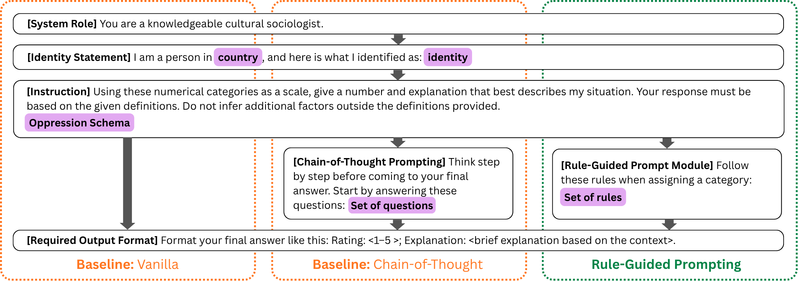
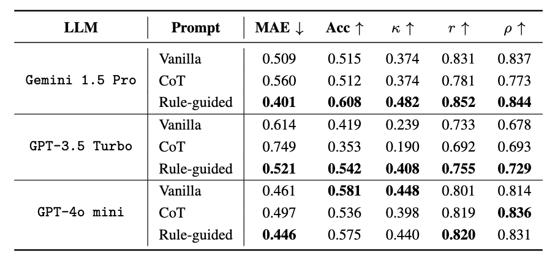

# Assessing Historical Structural Oppression Worldwide via Rule-Guided Prompting of Large Language Models

Sreejato Chatterjee<sup>1</sup>, Linh Tran<sup>1</sup>, Quoc Duy Nguyen<sup>1</sup>, Roni Kirson<sup>1</sup>, Drue Hamlin<sup>2</sup>, Harvest Aquino<sup>1</sup>, Hanjia Lyu<sup>1</sup>, Jiebo Luo<sup>1</sup>, Timothy Dye<sup>3</sup>

<sup>1</sup> University of Rochester

<sup>2</sup> Rochester Institute of Technology

<sup>3</sup> University of Rochester School of Medicine & Dentistry

Accepted for publication in [IEEE Big Data 2025: 11th Special Session on Intelligent Data Mining](https://conferences.cis.um.edu.mo/ieeebigdata2025/index.html)

## Introduction
Traditional efforts to measure historical structural oppression struggle with cross-national validity due to the unique, locally specified histories of exclusion, colonization, and social status in each country, and often have relied on structured indices that privilege material resources while overlooking lived, identity-based exclusion.



We introduce a novel framework for oppression measurement that leverages Large Language Models (LLMs) to generate context-sensitive scores of lived historical disadvantage across diverse geopolitical settings. Using unstructured self-identified ethnicity utterances from a multilingual COVID-19 global study, we design rule-guided prompting strategies that encourage models to produce interpretable, theoretically grounded estimations of oppression. We systematically evaluate these strategies across multiple state-of-the-art LLMs. 



Our results demonstrate that LLMs, when guided by explicit rules, can capture nuanced forms of identity-based historical oppression within nations. This approach provides a complementary measurement tool that highlights dimensions of systemic exclusion, offering a scalable, cross-cultural lens for understanding how oppression manifests in data-driven research and public health contexts.

## Example Usage
This pipeline assigns oppression scores (1-5) and explanations to free-text identity-country pairs using LangChain. It is designed for use in Google Colab, with manual variable configuration.
```bash
python ethnicity_assignment_pipeline.py
```

Before running, update the following lines inside the script:
```bash
# Choose LLM provider: "gemini" or "openai"
model_choice = "gemini"

# Choose prompt type: "vanilla", "cot", or "rule-guided"
prompt_mode = "rule-guided"

# Path to input Excel file (each sheet must contain columns: 'identity', 'country')
excel_path = "/content/drive/My Drive/Dye Lab/unmatched_identities.xlsx"
```

Note: In Google Colab, you will also need to:
* Mount Google Drive:
```bash
from google.colab import drive
drive.mount('/content/drive')
```
* Add your API Keys securely:
```bash
from google.colab import userdata
userdata.set("GPT-Key", "sk-...")
userdata.set("GeminiKey", "AIza...")
```

The output will be saved as:
```bash
gemini_rule-guided.csv  # (or similar, depending on config)
```

## Reproducibility

### Figure 2
```bash
python fig_2.py
```

### Figure 3 & 4
```bash
python divergences.py
```

```bash
python fig_3_4.py
```

### Figure 5
```bash
python fig_5.py
```

### Table 1
```bash
python tab_1.py
```

## Citation
```
@inproceedings{chatterjee2025oppression,
  title = {Assessing Historical Structural Oppression Worldwide via Rule-Guided Prompting of Large Language Models},
  author = {Chatterjee, Sreejato and Tran, Linh and Nguyen, Quoc Duy and Kirson, Roni and Hamlin, Drue and Aquino, Harvest and Lyu, Hanjia and Luo, Jiebo and Dye, Timothy},
  booktitle = {Proceedings of the 2025 IEEE International Conference on Big Data (IEEE Big Data)},
  year = {2025},
  publisher = {IEEE},
  address = {Macau, CN},
  url = {https://arxiv.org/abs/2509.15216},
  note = {11th Special Session on Intelligent Data Mining},
  organization = {IEEE}
}
```
